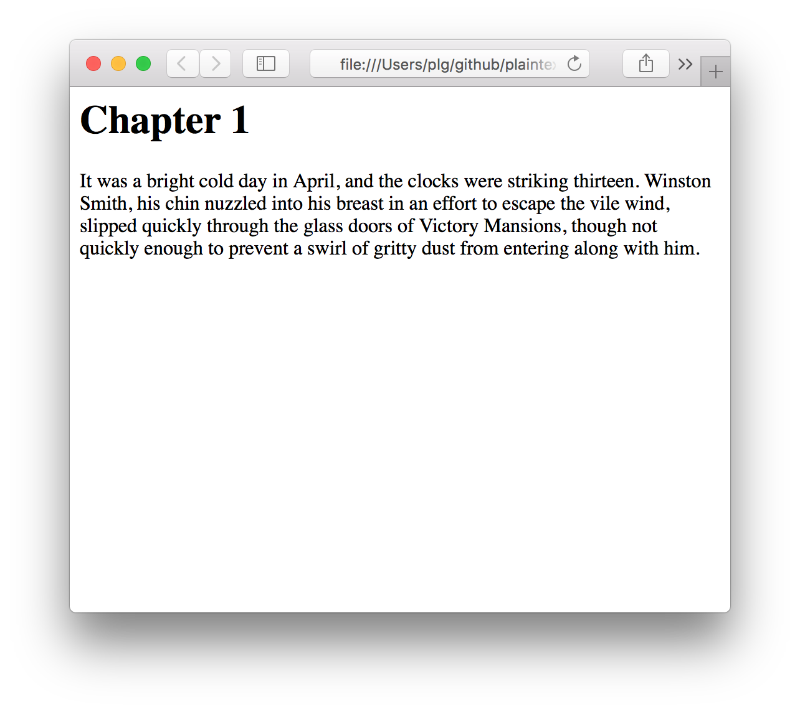
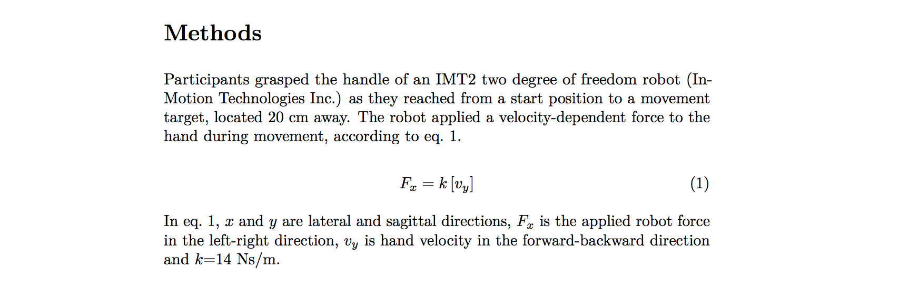
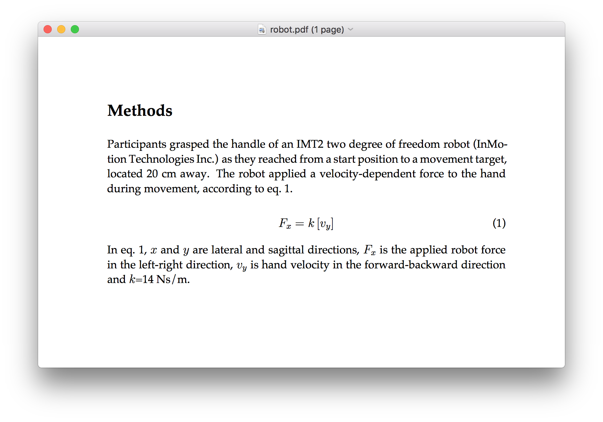
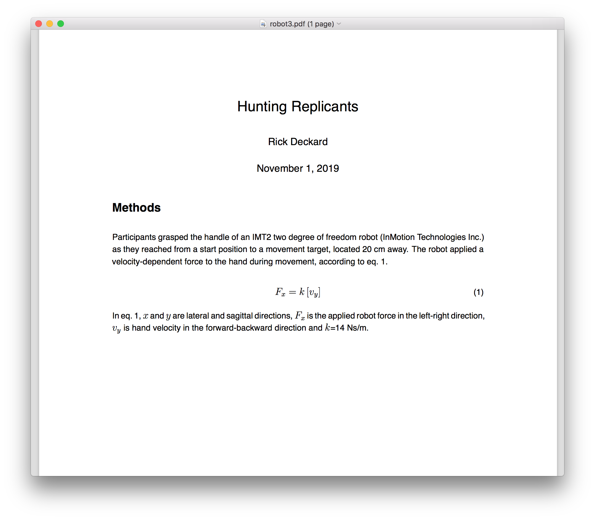
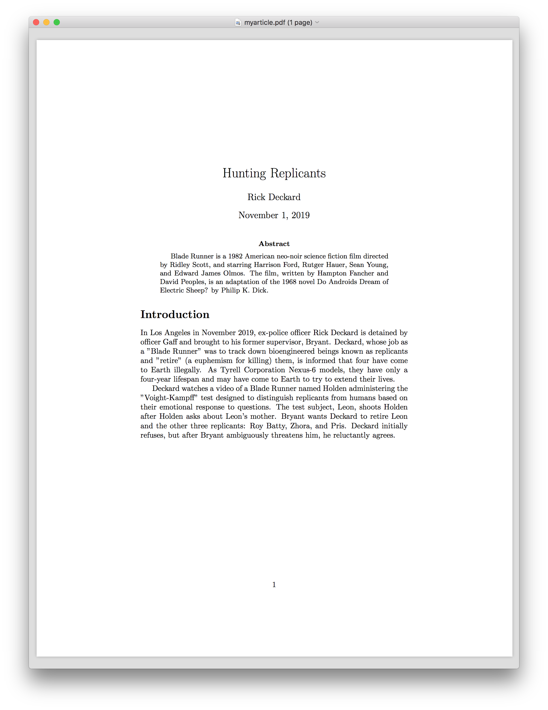
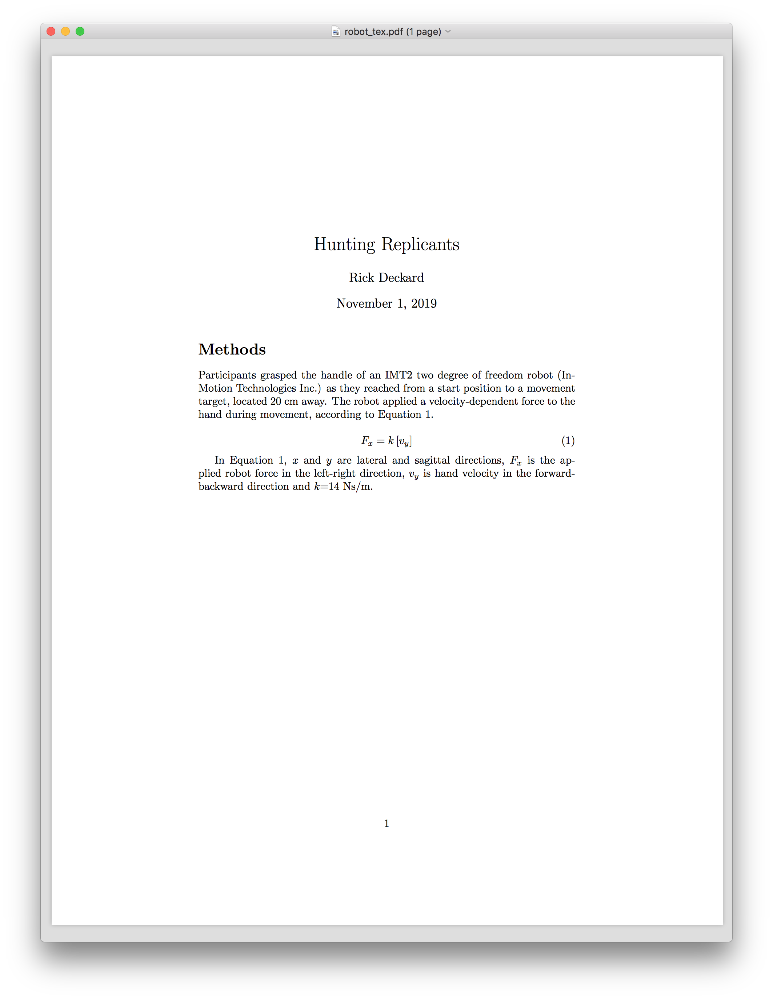
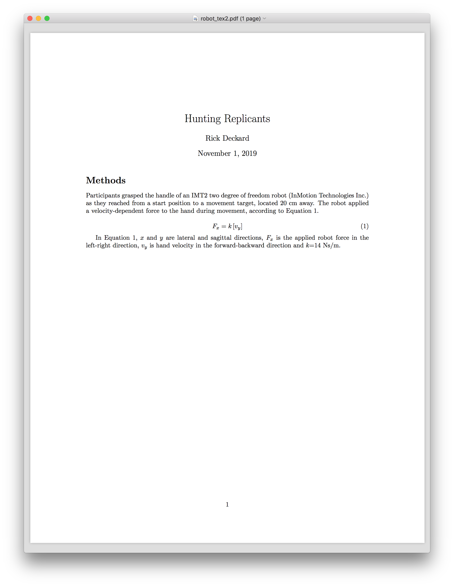
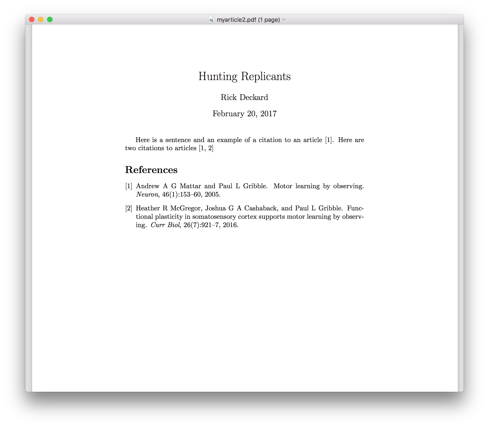
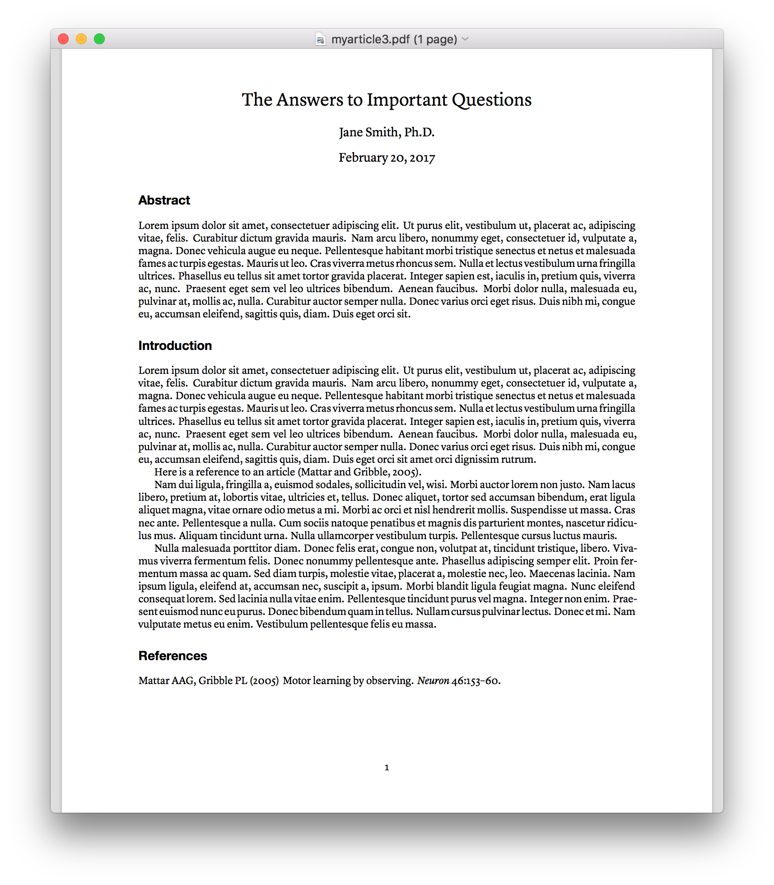

# plaintext_workshop

A workshop on Scientific Writing using plaintext tools like LaTeX,
Markdown & pandoc

February 21, 2017, 12:00pm---5:00pm, NSC 245A

# Why plaintext?

- separates content from formatting
- universally readable
- platform independent
- future-proof
- free and open source
- can easily use version control (e.g. [Git](https://git-scm.com) & [GitHub](https://github.com))
- can easily compare old vs new (e.g. opendiff (FileMerge) on OS X, e.g. [Meld](http://meldmerge.org) on Linux) 

There are many blog posts out there about the virtues of using plaintext to do scientific (or more generally, academic) writing. Here are some of them:

- [Sustainable Authorship in Plain Text using Pandoc and Markdown](http://programminghistorian.org/lessons/sustainable-authorship-in-plain-text-using-pandoc-and-markdown)
- [Academic Writing With Markdown](http://dylanstorey.com/2015/12/Academic_Writing_With_Markdown.html)
- [Why (and How) I Wrote My Academic Book in Plain Text](http://wcm1.web.rice.edu/my-academic-book-in-plain-text.html)
- [Markdown vs Latex for Academic Writing](http://jabranham.com/blog/2015/09/rmarkdown-vs-latex/)
- [Writing Technical Papers with Markdown](http://blog.kdheepak.com/writing-papers-with-markdown.html)
- [Plain text, Papers, Pandoc](https://kieranhealy.org/blog/archives/2014/01/23/plain-text/)

# Software

If you're on MacOS it would be a good idea to install [Homebrew](http://brew.sh), a package manager that gives you easy access to installing all sorts of useful GNU/Linux tools including some of the tools listed here.

## LaTeX 

First let's **install LaTeX**. It's a large download. If you're on a Mac, install LaTeX using the downloadable binary installer. If you're on Ubuntu or another debian-based GNU/Linux, `sudo apt-get install texlive-full`.

- [LaTeX](https://www.latex-project.org)
  - MacOS: [MacTeX](http://www.tug.org/mactex/)
  - GNU/Linux: [TeX Live](https://wiki.debian.org/Latex)
  - Windows: [MiKTeX](https://miktex.org)

## Pandoc

Next let's **install pandoc** and some extras. 

If you're on a Mac, and if you've installed homebrew, you can install pandoc using: `brew install pandoc pandoc-citeproc pandoc-crossref`. On GNU/Linux, I'm sure you can figure it out. I think pandoc is available using `sudo apt-get install pandoc` but I'm not sure about pandoc-citeproc and pandoc-crossref. Some googling should bring you an answer.

- [pandoc](http://pandoc.org/installing.html)

## Text Editor

You will need a good **text editor** as well. There are many to choose from. Personally I use Emacs and Sublime Text. For our purposes here we don't need much sophistication so it comes down to personal preference.

Here is a list of some text editors:

- [Emacs](https://www.gnu.org/software/emacs/)
- [Vim](http://www.vim.org/download.php)
- [Sublime Text](https://www.sublimetext.com)
- [Atom](https://atom.io)
- [BBEdit](http://www.barebones.com/products/bbedit/index.html)
- [Notepad++](https://notepad-plus-plus.org)
- [Visual Studio Code](https://code.visualstudio.com)
- [Gedit](https://wiki.gnome.org/Apps/Gedit)

There are some GUI-based LaTeX editors as well, if you're into that sort of thing (I'm not): 

- [TeXmaker](http://www.xm1math.net/texmaker/)
- [TeXstudio](http://www.texstudio.org)
- [TeXworks](https://www.tug.org/texworks/)

There are also online LaTeX editors/compilers/environments. The advantage is that you don't have to install LaTeX locally on your own machine, and you don't have to worry about installing packages and updating outdated packages (they are all in the cloud). The disdvantage is that you can't do anything if you're not connected to the internet.

- [ShareLaTeX](https://www.sharelatex.com)
- [Overleaf](https://www.overleaf.com)

There are also many, many Markdown-specific editors. This means they are meant for editing Markdown in particular, and they come with various kinds of built-in smarts for pretty-formatting Markdown.

Here are some:

- [iA Writer](https://ia.net/writer/)
- [Marked](http://marked2app.com)
- [MacDown](https://macdown.uranusjr.com)
- [Bear](http://www.bear-writer.com)
- [Ulysses](https://www.ulyssesapp.com)
- [Typora](https://typora.io)
- [Mou](http://25.io/mou/)

If you're using Sublime Text (as I am) there is a nice Markdown plugin called [MarkdownEditing](https://github.com/SublimeText-Markdown/MarkdownEditing).

# Markdown

Let's start with Markdown, rather than LaTeX, since Markdown is less intimidating.

Markdown is a specification for "marking up" plain text documents using not-terribly-difficult-or-offensive codes that denote semantic elements. By "semantic elements" I mean things like headings, sub-headings, quotes, and so on. There are also variants of Markdown, such as Git-Markdown, that add various other codes to further extend Markdown's capabilities.

This document that you're reading (`README.md`) is a Markdown document. If you're reading it on GitHub, it's been rendered for you in your web browser by GitHub.

Here are some Markdown references online:

- [Markdown](http://daringfireball.net/projects/markdown/): The original specification by John Gruber
- [Mastering Markdown](https://guides.github.com/features/mastering-markdown/): a brief tutorial by GitHub

## Simple Markdown Document

Here is a very simple Markdown document:

``` {.markdown}
# Chapter 1

It was a bright cold day in April, and the clocks were striking
thirteen. Winston Smith, his chin nuzzled into his breast in an effort
to escape the vile wind, slipped quickly through the glass doors of
Victory Mansions, though not quickly enough to prevent a swirl of
gritty dust from entering along with him.
```

We have a heading, denoted using the `#` symbol, called "Chapter 1", followed by a paragraph of plain text. There are lots of other elements we can denote using Markdown, including things like lists, images, quotes, code listings, and so on. See the documentation for examples.

Note that there is no *stylistic* specification within a Markdown document. The codes denote semantic elements not stylistic elements. This is part of the philosophy of separating content from style. The idea is that one can take a semantically coded plain text Markdown document, and convert it into another format, such as HTML, or pdf, or a host of other formats, and along the way, specify a particular *style*---that is, a sort of translation of what each semantic element should look like.

If you've coded in HTML and used CSS files, this is the same idea.

The program we are going to use to perform this conversion is **Pandoc**.

# Pandoc

Pandoc is a program that can convert not just from Markdown to a host of other formats, but can convert from multiple formats to multiple formats. The [list of formats](http://pandoc.org) pandoc knows about is long.

## Pandoc Links

Here are some resources for working with pandoc:

- [Getting started with pandoc](http://pandoc.org/getting-started.html)
- [Pandoc Demos](http://pandoc.org/demos.html)
- [Pandoc FAQs](http://pandoc.org/faqs.html)
- [Pandoc Manual](http://pandoc.org/MANUAL.html)
- [Pandoc crossref](https://github.com/lierdakil/pandoc-crossref) for
  numbering figures, equations, tables and cross-references to them
- [Pandoc citeproc](https://github.com/jgm/pandoc-citeproc) for
  citations & bibliographies
- [Citation Style Language (CSL) citation styles](https://github.com/citation-style-language/styles)
- [Documentation and Tutorials](https://github.com/jgm/pandoc/wiki/Documentation-and-Tutorials)
- [User contributed templates](https://github.com/jgm/pandoc/wiki/User-contributed-templates)

## Convert Markdown to .pdf using Pandoc (via LaTeX under the hood)

Let's take the sample Markdown document above (the opening paragraph of George Orwell's "Nineteen Eighty Four") and convert it, using pandoc, to another format.

First save the document in a plain text file, let's call it `1984.md`. Now let's convert it into HTML format using pandoc:

``` {.bash}
pandoc 1984.md -o 1984.html
```

The file we get looks like this:

```html
<h1 id="chapter-1">Chapter 1</h1>
<p>It was a bright cold day in April, and the clocks were striking
thirteen. Winston Smith, his chin nuzzled into his breast in an effort
to escape the vile wind, slipped quickly through the glass doors of
Victory Mansions, though not quickly enough to prevent a swirl of
gritty dust from entering along with him.</p>
```

What you can see is that pandoc has basically translated the Markdown semantic codes into the corresponding HTML codes. In fact if you double-click on the `1984.html` file, and open it in a web browser, it will render the html file for you in the browser:



This sample document isn't very interesting, at least it doesn't make use of very many Markdown features. Let's have a look at another example that's closer to what we might be doing as academic writers:

## An Equation

``` {.markdown}
# Methods

Participants grasped the handle of an IMT2 two degree of freedom robot
(InMotion Technologies Inc.) as they reached from a start position to
a movement target, located 20 cm away. The robot applied a
velocity-dependent force to the hand during movement, according to
[@eq:forcefield].

$$
    F_{x} = k \left[ v_{y} \right]
$$ {#eq:forcefield}

In [@eq:forcefield], $x$ and $y$ are lateral and sagittal directions,
$F_{x}$ is the applied robot force in the left-right direction,
$v_{y}$ is hand velocity in the forward-backward direction and $k$=14
Ns/m.
```

Here we have a heading `# Methods` followed by some text, and then an equation, denoted using `$$` codes to start and then end the equation. The equation is specified using LaTeX syntax. After the final `$$` code that denotes the end of the equation, we have a Markdown code that *labels* the equation using a label of our choice, in this case `forcefield`. What this enables us to do is refer to this equation using the *label*, and let Pandoc figure out the equation numbering. This is great, it means if we have many equations, we don't have to manually number them.

Save the above Markdown text in a plain text file called `robot.md` and let's convert it using pandoc to pdf format.

``` {.bash}
pandoc robot.md --filter pandoc-crossref -o robot.pdf
```

Now open the file `robot.pdf` and you will see something like this:



Pandoc actually uses LaTeX under the hood to convert from Markdown to pdf. We get a Heading ("Methods") in large, boldface font. We get a paragraph typset using a serif font (LaTeX uses a font called Computer Modern by default), and full-justified. We get our equation centered and numbered. 

Note in the pandoc command above we used the flag `--filter pandoc-crossref`. This is needed in order to handle the equation labels and numbering properly.

The `[@eq:forcefield]` code we used to refer to our equation has been properly converted into "eq. 1". This is really useful once you have many equations. When you decide to reorder them, or delete some, or add some, you don't have to worry about maintaining the correct numbering. LaTeX does this for you. It also does this for Figure numbers, Table numbers, bibliographic references, table of contents, even an Index if you want one in your document.

## Changing the font

Let's say you're not too fond of Computer Modern as a font choice. We can change that.

When Pandoc converts to pdf, it uses LaTeX as an in-between. In fact, Pandoc uses a LaTeX *template* to generate a LaTeX file, which is then converted, using LaTeX, to pdf. You can acutally see what the template looks like by typing:

``` {.bash}
pandoc -D latex > template.latex
```

and then opening the `template.latex` file you just created. It looks crazy if you've never seen LaTeX code before, and probably still looks icky even if you have. Pandoc has inserted a number of *variables* into the LaTeX document that lets you control various aspects of the final pdf output, using command-line arguments to Pandoc.

So for example to change the font to Helvetica, and to use 12pt instead of the default Computer Modern 10pt font, we can issue the Pandoc command like so:

``` {.bash}
pandoc robot.md \
--filter pandoc-crossref \
-V mainfont=Helvetica \
-V fontsize=12pt \
--latex-engine=xelatex \
-o robot2.pdf
```

Now our document looks like this:



Our font is now Helvetica and the size is 12pt.

## Pandoc Variables for LaTeX

In the Pandoc command above, we use the `-V` flag to tell Pandoc to set a *variable* to a particular value. For example the `mainfont` variable is set to `Helvetica`, and the `fontsize` variable is set to `12pt`.

There is a whole bunch of variables that can be sent to Pandoc in order to control the look of your output, here is the relevant section of the Pandoc documentation:

[Pandoc variables for LaTeX](http://pandoc.org/MANUAL.html#variables-for-latex)

Note that when changing the font away from one of the LaTeX standard choices (which are few, and arguably ugly), we have to tell Pandoc to use the `xelatex` engine instead of the standard LaTeX engine, to generate the pdf file. This is done with the command-line flag `--latex-engine=xelatex`. The standard LaTeX engine for generating a pdf is called `pdflatex` but it doesn't handle non-default fonts well. The `xelatex` engine does, so any time we want to change font away from the LaTeX defaults, I would suggest using this `--latex-engine=xelatex` flag. The `xelatex` engine allows you to use any font that's installed on your system.

There are many document-styling variables that you can control directly from the command-line invocation of Pandoc. I suggest looking at the Pandoc documentation and trying things out. In the event you can't do what you need on the command line, you might be able to do it by putting LaTeX commands into a file, and telling Pandoc to load that in as well when doing the conversion (this would be using the `-H` flag). Once you start doing complex things like this though, the question arises, why not just use LaTeX directly.

## The Pandoc Command For This Document

Here is the command I use to convert this `README.md` document into a pdf file:

``` {.bash}
pandoc README.md \
-V geometry:margin=1.0in \
-V mainfont=Helvetica \
-V monofont=Monaco \
-V fontsize=12pt \
-V colorlinks \
--latex-engine=xelatex \
--highlight-style=tango \
-o README.pdf
```

## Commands & Metadata in a YAML header

```{.markdown}
---
title: Hunting Replicants
author: Rick Deckard
date: November 1, 2019
papersize: letter
mainfont: "Helvetica"
fontsize: 12pt
geometry: margin=1.2in
---

# Methods

Participants grasped the handle of an IMT2 two degree of freedom robot
(InMotion Technologies Inc.) as they reached from a start position to
a movement target, located 20 cm away. The robot applied a
velocity-dependent force to the hand during movement, according to
[@eq:forcefield].

$$
    F_{x} = k \left[ v_{y} \right]
$$ {#eq:forcefield}

In [@eq:forcefield], $x$ and $y$ are lateral and sagittal directions,
$F_{x}$ is the applied robot force in the left-right direction,
$v_{y}$ is hand velocity in the forward-backward direction and $k$=14
Ns/m.
```

Here we include, along with the title, author and date, various formatting options in the main document itself.

``` {.bash}
pandoc robot.md \
--filter pandoc-crossref \
--latex-engine=xelatex \
-o robot3.pdf
```

Now our document looks like this:



## Commands & Metadata in a separate file

We can put the formatting stuff into a separate file, called say 'formatting.yaml`:

```{.markdown}
---
papersize: letter
mainfont: "Helvetica"
fontsize: 12pt
geometry: margin=1.2in
---
```

and leave the header of our main document for just the content, no formatting:

```{.markdown}
---
title: Hunting Replicants
author: Rick Deckard
date: November 1, 2019
---
```

The advantage of this is we really do separate out content from formatting. Now the command to convert from `robot.md` to pdf would be:

    pandoc robot.md -o robot.pdf formatting.yaml --latex-engine=xelatex

We include `formatting.yaml` to tell pandoc to include the header info found in the file `formatting.yaml` when performing the conversion.

## Citations & Bibliographies

xxx


# LaTeX

LaTeX is a document typesetting system that is generally used to create .pdf files. It is very powerful and can be used to create all sorts of documents including papers/essays, letters, books, business cards, flyers, presentation slides, etc. It's not difficult to create documents using the default LaTeX styles. Once you want to customize the look of your document, things get a bit more difficult, but only because you won't know what LaTeX commands to use. Fortunately there are a *lot* of resources to help online, and you can typically search using Google for how to do something, and find a reasonable answer within the first few hits. Here are some LaTeX tutorials online:

- [LaTeX on WikiBooks](https://en.wikibooks.org/wiki/LaTeX)
- [Introduction to LaTeX](https://www.overleaf.com/latex/learn/free-online-introduction-to-latex-part-1)
- [LaTeX Tutorial](https://www.latex-tutorial.com/tutorials/)
- [Beginners LaTeX Tutorial](https://www.sharelatex.com/blog/latex-guides/beginners-tutorial.html)


## A Basic LaTeX Article

LaTeX has a number of default [document classes](https://en.wikibooks.org/wiki/LaTeX/Document_Structure#Document_classes) to choose from when creating a document. These include `article`, `report`, `book`, `letter`, `beamer` (for slides), etc. Typically I use `article` for writing papers and most short documents. For my notes for my graduate course, [Scientific Computing with MATLAB](http://www.gribblelab.org/scicomp/), I used the `book` class (see [here](https://github.com/paulgribble/SciComp/blob/master/scicomp.tex)).

Let's use the `article` class and write a simple article with a title, an author, a date, an Abstract, and a couple of paragraphs of text. Save this as a file called `myarticle.tex`:

```{.tex}
\documentclass{article}

\title{Hunting Replicants}
\author{Rick Deckard}
\date{November 1, 2019}

\begin{document}

\maketitle

\begin{abstract}
  Blade Runner is a 1982 American neo-noir science fiction film
  directed by Ridley Scott, and starring Harrison Ford, Rutger Hauer,
  Sean Young, and Edward James Olmos. The film, written by Hampton
  Fancher and David Peoples, is an adaptation of the 1968 novel Do
  Androids Dream of Electric Sheep? by Philip K. Dick.
\end{abstract}

\section*{Introduction}

In Los Angeles in November 2019, ex-police officer Rick Deckard is
detained by officer Gaff and brought to his former supervisor,
Bryant. Deckard, whose job as a ``Blade Runner'' was to track down
bioengineered beings known as replicants and ``retire'' (a euphemism
for killing) them, is informed that four have come to Earth
illegally. As Tyrell Corporation Nexus-6 models, they have only a
four-year lifespan and may have come to Earth to try to extend their
lives.

Deckard watches a video of a Blade Runner named Holden administering
the ``Voight-Kampff'' test designed to distinguish replicants from
humans based on their emotional response to questions. The test
subject, Leon, shoots Holden after Holden asks about Leon's
mother. Bryant wants Deckard to retire Leon and the other three
replicants: Roy Batty, Zhora, and Pris. Deckard initially refuses, but
after Bryant ambiguously threatens him, he reluctantly agrees.

\end{document}
```

Note how quotation marks in LaTeX are left & right specific. That is, we use double single-left-quotes for left-quotation marks, and double single-right-quotes for right-quotation marks:

```{.tex}
We quote like ``this'' and not like "this"
```

To compile this LaTeX document into a pdf we can issue the following command:

```{.bash}
pdflatex myarticle.tex
```

A bunch of strange looking log messages get spit out:

```{.bash}
fuji:plaintext_workshop plg$ pdflatex myarticle.tex
This is pdfTeX, Version 3.14159265-2.6-1.40.16 (TeX Live 2015) (preloaded format=pdflatex)
 restricted \write18 enabled.
entering extended mode
(./myarticle.tex
LaTeX2e <2015/01/01>
Babel <3.9l> and hyphenation patterns for 79 languages loaded.
(/usr/local/texlive/2015/texmf-dist/tex/latex/base/article.cls
Document Class: article 2014/09/29 v1.4h Standard LaTeX document class
(/usr/local/texlive/2015/texmf-dist/tex/latex/base/size10.clo))
No file myarticle.aux.
[1{/usr/local/texlive/2015/texmf-var/fonts/map/pdftex/updmap/pdftex.map}]
(./myarticle.aux) )</usr/local/texlive/2015/texmf-dist/fonts/type1/public/amsfo
nts/cm/cmbx12.pfb></usr/local/texlive/2015/texmf-dist/fonts/type1/public/amsfon
ts/cm/cmbx9.pfb></usr/local/texlive/2015/texmf-dist/fonts/type1/public/amsfonts
/cm/cmr10.pfb></usr/local/texlive/2015/texmf-dist/fonts/type1/public/amsfonts/c
m/cmr12.pfb></usr/local/texlive/2015/texmf-dist/fonts/type1/public/amsfonts/cm/
cmr17.pfb></usr/local/texlive/2015/texmf-dist/fonts/type1/public/amsfonts/cm/cm
r9.pfb>
Output written on myarticle.pdf (1 page, 77054 bytes).
Transcript written on myarticle.log.
```

Now there is a file called `myarticle.pdf`. Here is what the .pdf file looks like:



In the case where the LaTeX processor didn't like something, for example if you mis-spelled a LaTeX command, or some other error occurred, you would see an error reported in the log output, and the .pdf file will probably not be generated.

## Equations

Here is the Markdown article `robot.md` from above, written in LaTeX (let's call it `robot_tex.tex`):

```{.tex}
\documentclass{article}

\title{Hunting Replicants}
\author{Rick Deckard}
\date{November 1, 2019}

\begin{document}

\maketitle

\section*{Methods}

Participants grasped the handle of an IMT2 two degree of freedom robot (InMotion Technologies Inc.) as they reached from a start position to a movement target, located 20 cm away. The robot applied a velocity-dependent force to the hand during movement, according to Equation \ref{eq:forcefield}.

\begin{equation}
    F_{x} = k \left[ v_{y} \right]
\label{eq:forcefield}
\end{equation}

In Equation \ref{eq:forcefield}, $x$ and $y$ are lateral and sagittal directions, $F_{x}$ is the applied robot force in the left-right direction, $v_{y}$ is hand velocity in the forward-backward direction and $k$=14 Ns/m.

\end{document}
```

Now we issue the command `pdflatex robot_tex.tex` and we get the following output:

```{.bash}
fuji:plaintext_workshop plg$ pdflatex robot_tex.tex
This is pdfTeX, Version 3.14159265-2.6-1.40.16 (TeX Live 2015) (preloaded format=pdflatex)
 restricted \write18 enabled.
entering extended mode
(./robot_tex.tex
LaTeX2e <2015/01/01>
Babel <3.9l> and hyphenation patterns for 79 languages loaded.
(/usr/local/texlive/2015/texmf-dist/tex/latex/base/article.cls
Document Class: article 2014/09/29 v1.4h Standard LaTeX document class
(/usr/local/texlive/2015/texmf-dist/tex/latex/base/size10.clo)) (./robot_tex.aux)

LaTeX Warning: Reference `eq:forcefield' on page 1 undefined on input line 13.


LaTeX Warning: Reference `eq:forcefield' on page 1 undefined on input line 20.

[1{/usr/local/texlive/2015/texmf-var/fonts/map/pdftex/updmap/pdftex.map}]
(./robot_tex.aux)

LaTeX Warning: There were undefined references.


LaTeX Warning: Label(s) may have changed. Rerun to get cross-references right.

 )</usr/local/texlive/2015/texmf-dist/fonts/type1/public/amsfonts/cm/cmbx10.pfb
></usr/local/texlive/2015/texmf-dist/fonts/type1/public/amsfonts/cm/cmbx12.pfb>
</usr/local/texlive/2015/texmf-dist/fonts/type1/public/amsfonts/cm/cmmi10.pfb><
/usr/local/texlive/2015/texmf-dist/fonts/type1/public/amsfonts/cm/cmmi7.pfb></u
sr/local/texlive/2015/texmf-dist/fonts/type1/public/amsfonts/cm/cmr10.pfb></usr
/local/texlive/2015/texmf-dist/fonts/type1/public/amsfonts/cm/cmr12.pfb></usr/l
ocal/texlive/2015/texmf-dist/fonts/type1/public/amsfonts/cm/cmr17.pfb>
Output written on robot_tex.pdf (1 page, 71769 bytes).
Transcript written on robot_tex.log.
```

Note how in the output we are told: `LaTeX Warning: Label(s) may have changed. Rerun to get cross-references right.`. This is because LaTeX needs to process the file a second time, to get the numbering right for the equation(s). So we issue the command a second time, `pdflatex robot_tex.tex`:

```{.bash}
This is pdfTeX, Version 3.14159265-2.6-1.40.16 (TeX Live 2015) (preloaded format=pdflatex)
 restricted \write18 enabled.
entering extended mode
(./robot_tex.tex
LaTeX2e <2015/01/01>
Babel <3.9l> and hyphenation patterns for 79 languages loaded.
(/usr/local/texlive/2015/texmf-dist/tex/latex/base/article.cls
Document Class: article 2014/09/29 v1.4h Standard LaTeX document class
(/usr/local/texlive/2015/texmf-dist/tex/latex/base/size10.clo)) (./robot_tex.aux)
[1{/usr/local/texlive/2015/texmf-var/fonts/map/pdftex/updmap/pdftex.map}]
(./robot.aux) )</usr/local/texlive/2015/texmf-dist/fonts/type1/public/amsfonts/
cm/cmbx12.pfb></usr/local/texlive/2015/texmf-dist/fonts/type1/public/amsfonts/c
m/cmmi10.pfb></usr/local/texlive/2015/texmf-dist/fonts/type1/public/amsfonts/cm
/cmmi7.pfb></usr/local/texlive/2015/texmf-dist/fonts/type1/public/amsfonts/cm/c
mr10.pfb></usr/local/texlive/2015/texmf-dist/fonts/type1/public/amsfonts/cm/cmr
12.pfb></usr/local/texlive/2015/texmf-dist/fonts/type1/public/amsfonts/cm/cmr17
.pfb>
Output written on robot_tex.pdf (1 page, 62912 bytes).
Transcript written on robot_tex.log.
```

This time we get no warnings or errors, and there is a .pdf file called `robot_tex.pdf`:



## Styling a LaTeX Document

There are many aspects of the style we may want to adjust, including things like:

- page margins
- paragraph indentation
- paragraph spacing
- line spacing
- fonts
- section heading spacing & font

### Page Margin

The easiest way to do this is to use the `geometry` package. To use LaTeX packages (which are add-ons that provide additional functionality) we issue the `\usepackage{}` command, in the document preamble, i.e. before the `\begin{document}` command:

```{.tex}
\documentclass{article}

\title{Hunting Replicants}
\author{Rick Deckard}
\date{November 1, 2019}

\usepackage[margin=1.2in]{geometry}

\begin{document}

\maketitle

\section*{Methods}

Participants grasped the handle of an IMT2 two degree of freedom robot (InMotion Technologies Inc.) as they reached from a start position to a movement target, located 20 cm away. The robot applied a velocity-dependent force to the hand during movement, according to Equation \ref{eq:forcefield}.

\begin{equation}
    F_{x} = k \left[ v_{y} \right]
\label{eq:forcefield}
\end{equation}

In Equation \ref{eq:forcefield}, $x$ and $y$ are lateral and sagittal directions, $F_{x}$ is the applied robot force in the left-right direction, $v_{y}$ is hand velocity in the forward-backward direction and $k$=14 Ns/m.

\end{document}
```

We now get a document that looks like this:



## Paragraph indentation & spacing

The default LaTeX style is such that paragraphs don't have extra spacing in between them, and the first line of a paragraph is indented (except for the first paragraph in a section). Let's say instead we wanted a space in between paragraphs, and no indentation. We could issue the following two commands in the preamble:

```{.tex}
\setlength{\parskip}{1ex}            % space between paragraphs
\setlength{\parindent}{0ex}          % paragraph indentation
```

In LaTeX  `1.0ex` is a vertical space roughly equal to the vertical height of the font being used.

## Line spacing

We can use `linespread` and issue the following command in the preamble, to get double-spacing:

```{.tex}
\linespread{2}
```


## Fonts in LaTeX

### Built-in LaTeX Fonts

We have two choices in LaTeX for handling fonts. The default way is to use `pdflatex` to do the conversion from a `.tex` file to a `.pdf` file (the way we've been doing it so far). In this case we are restricted to using one or more of the built-in fonts in LaTeX. We can see them all, and the commands to activate them, here:

- [LaTeX Font Catalogue](http://www.tug.dk/FontCatalogue/)

So for example to change to [Garamond](http://www.tug.dk/FontCatalogue/garamond/) font we could issue the following command in the preamble:

```{.tex}
\usepackage[urw-garamond]{mathdesign}
\usepackage[T1]{fontenc}
```

### Use Any Font

There is also a way to use any font we want (well, any font that's installed on our computer). We use the `fontspec` package, and we use `xelatex` instead of `pdflatex` to compile the `.tex` file into a .pdf file.

- [Fontspec](https://www.ctan.org/pkg/fontspec?lang=en) (for XeLaTeX)

So for example to use the font `Helvetica Neue` (which I have installed on my Mac), we would issue this command in the preamble:

```{.tex}
\usepackage{fontspec}
\setmainfont{Helvetica Neue}
```

And then issue the following command to compile the `.tex` file into a .pdf:

```{.bash}
xelatex robot_tex.tex
```

## Citations & Bibliographies

As with many things in LaTeX, there are some [built-in bibliography styles](https://www.sharelatex.com/learn/Bibtex%20bibliography%20styles#/Biblatex_styles), but you can also find third-party style files that define other bibliography styles, and you can also create your own style file if you can't find an existing bibliography style file.

Typically, information about the articles you are going to cite in a LaTeX document (the database of bibliography entries) is stored in a format called BibTeX, in a file with a `.bib` suffix. This is also a plain-text document. Here is an example of a small simple `.bib` file, called `refs.bib`:

```{.tex}
@Article{   mattar:2005aa,
  author  = {Mattar, Andrew A G and Gribble, Paul L},
  doi   = {10.1016/j.neuron.2005.02.009},
  journal = {Neuron},
  number  = {1},
  pages   = {153-60},
  pmid    = {15820701},
  title   = {Motor learning by observing},
  volume  = {46},
  year    = {2005}
}

@Article{     mcgregor:2016aa,
  author    = {McGregor, Heather R and Cashaback,
    Joshua G A and Gribble, Paul L},
  doi       = {10.1016/j.cub.2016.01.064},
  journal   = {Curr Biol},
  number    = {7},
  pages     = {921-7},
  pmid      = {26972317},
  title     = {Functional Plasticity in Somatosensory Cortex
    Supports Motor Learning by Observing},
  volume    = {26},
  year      = {2016}
}
```

Each entry has the usual fields (and others are possible but not shown here), and importantly, each entry has a unique **keyword** that is the way we will refer to each entry, within our LaTeX document. This is how we will cite articles/books.

Many popular bibliography database programs, like Endnote, Zotero, Mendelay, Papers.app, etc, can export a database or a selection of articles in `.bib` format. Also, PubMed and Google Scholar can directly export entries as a `.bib` file.

To cite an entry in our bibliography, we use the `\cite` command.

Here's an example of a simple document that uses one of the default styles, let's call this file `myarticle2.tex`

```{.tex}
\documentclass{article}

\title{Hunting Replicants}
\author{Rick Deckard}

\begin{document}

\maketitle

Here is a sentence and an example of a citation 
to an article \cite{mattar:2005aa}. Here are two 
citations to articles \cite{mattar:2005aa, mcgregor:2016aa}

\bibliographystyle{unsrt} 
\bibliography{refs}

\end{document}
```

We use the `\bibliographystyle` command to tell LaTeX which citation and bibliography style to use, and we use the `\bibliography` command to tell LaTeX which file to use to look for the references we are citing.

To compile the article we need to issue a series of commands:

```{.bash}
pdflatex myarticle2
bibtex myarticle2
pdflatex myarticle2
pdflatex myarticle2
```

Here is what the document looks like:



- [LaTeX & BiBTeX style files for biology](https://schneider.ncifcrf.gov/latex.html) (and other sciences)

### The natbib package

For some more flexibility in how to cite, you can use the `natbib` package. Here is a small example of using natbib, along with a bibliography style for Journal of Neuroscience, called `jneurosci`, let's call it `myarticle3.tex`:

```{.tex}
\documentclass[11pt]{article}

% use xelatex!
\usepackage{fontspec}
\usepackage{microtype} % Better typography
\setmainfont{Lyon Text}
\setsansfont{Helvetica Neue}

\usepackage[margin=1.0in]{geometry}

\usepackage{titlesec}
\titleformat*{\section}{\bfseries\sffamily\large}
\titleformat*{\subsection}{\bfseries\sffamily\normalsize}

\usepackage{natbib}

\usepackage{lipsum}

\title{The Answers to Important Questions}
\author{Jane Smith, Ph.D.}
\date{\today}

\begin{document}

\maketitle

\section*{Abstract}

\lipsum[1]

\section*{Introduction}

\lipsum[2]

Here is a reference to an article \citep{mattar:2005aa}.

\lipsum[3]

\bibliography{refs}
\bibliographystyle{jneurosci}

\end{document}
```

We have used the `lipsum` package here to generate some placeholder text. We have also used the `titlesec` package to define custom styles for section headings.

Here is what the article looks like:



- [using natbib](http://merkel.texture.rocks/Latex/natbib.php)

### Create your own bibliography style file

You can use the `makebst` utility to make your own bibliography style file. Issue the following command:

```{.bash}
latex makebst
```

and the `makebst` program will ask you a series of questions. At the end of the process you will have a `.bst` file that you can refer to in your `.tex` file, to use as a bibliography style.

- [Write your custom latex bibliography style in 5 minutes](http://gabrielelanaro.github.io/blog/2014/12/01/latex-bibliography-in-5-minutes.html)


# Markdown vs LaTeX

- Markdown has arguably nicer looking syntax
- Markdown has more output formats (via pandoc)
- LaTeX provides more control over fine-grained appearance

With pandoc you can take advantage of both. Provide pandoc with a
LaTeX template, containing all of the formatting details you want, and
keep the content in Markdown format.


